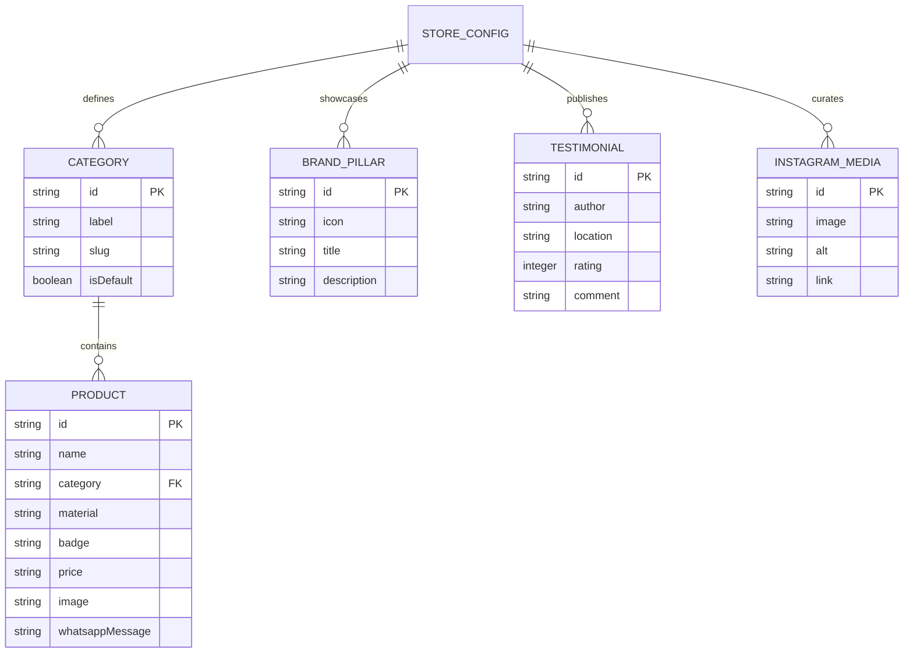
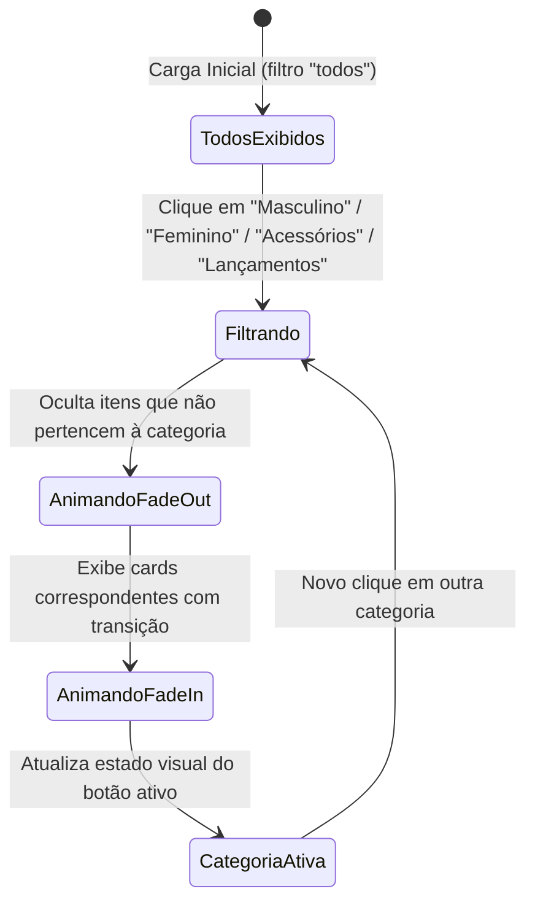
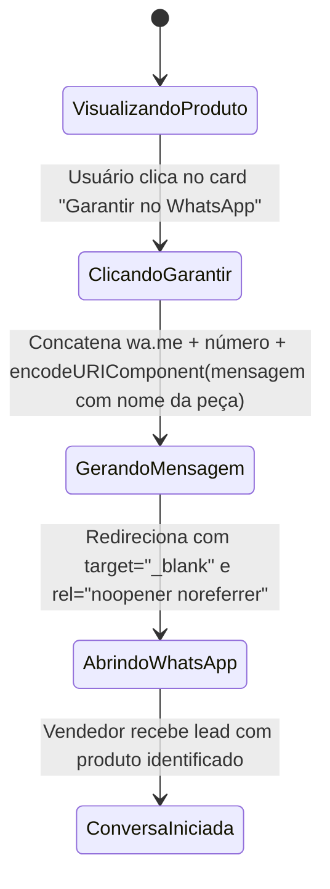

# Data Model: Landing Page Scorpion gytano

**Feature**: `001-scorpion-landing-page`  
**Date**: 2026-10-07  
**Status**: Validated

Este documento define as entidades de dados, estruturas de atributos, relacionamentos e regras de validação para a vitrine e conteúdos da landing page da **Scorpion gytano**.

---

## 1. Entidades Principais

### 1.1. Produto (`Product`)
Representa uma peça de vestuário ou acessório exposto na vitrine da loja.

| Campo | Tipo | Obrigatório | Descrição / Exemplo |
|-------|------|-------------|---------------------|
| `id` | `string` | Sim | Identificador único em kebab-case (ex: `"jaqueta-couro-premium"`). |
| `name` | `string` | Sim | Nome comercial da peça (ex: `"Jaqueta Couro Urban Rider"`). |
| `category` | `string` | Sim | Categoria de associação: `"masculino"`, `"feminino"`, `"acessorios"` ou `"lancamentos"`. |
| `material` | `string` | Sim | Breve descrição da composição/tecido (ex: `"Couro legítimo com forro térmico"`). |
| `badge` | `string` | Não | Tag visual de destaque: `"Mais Vendido"`, `"Lançamento"`, `"Edição Limitada"`, `"Destaque"`. |
| `price` | `string` | Não | Preço ou condição de pagamento formatada (ex: `"R$ 349,90 em até 3x"`). |
| `image` | `string` | Sim | Caminho relativo da imagem principal otimizada (ex: `"./assets/img/produtos/jaqueta-1.webp"`). |
| `hoverImage` | `string` | Não | Imagem alternativa para transição suave no hover (opcional). |
| `whatsappMessage` | `string` | Sim | Mensagem padrão contextualizada gerada para o link de compra do produto. |

#### Regras de Validação do Produto:
- `name` deve ter entre 3 e 80 caracteres.
- `category` deve coincidir exatamente com uma das categorias válidas do catálogo.
- `image` deve apontar para um arquivo existente no diretório `assets/img/`.
- `whatsappMessage` não pode ser vazia e deve conter o nome do produto.

---

### 1.2. Categoria (`Category`)
Representa uma aba/filtro temático para segmentação dos produtos na vitrine.

| Campo | Tipo | Obrigatório | Descrição / Exemplo |
|-------|------|-------------|---------------------|
| `id` | `string` | Sim | Identificador único (ex: `"todos"`, `"masculino"`, `"feminino"`, `"acessorios"`, `"lancamentos"`). |
| `label` | `string` | Sim | Nome legível exibido no botão da aba (ex: `"Lançamentos"`, `"Masculino"`). |
| `slug` | `string` | Sim | Slug para atributo de filtragem no DOM (`data-filter`). |
| `isDefault` | `boolean` | Sim | Indica se é a categoria selecionada inicialmente (ex: `true` para "todos" ou "lancamentos"). |

---

### 1.3. Diferencial / Garantia (`BrandPillar`)
Representa um dos 4 cards de confiança e garantia da Scorpion gytano.

| Campo | Tipo | Obrigatório | Descrição / Exemplo |
|-------|------|-------------|---------------------|
| `id` | `string` | Sim | Identificador (ex: `"envio-rapido"`). |
| `icon` | `string` | Sim | Ícone SVG ou emoji estilizado (ex: `"🚀"`). |
| `title` | `string` | Sim | Título do benefício (ex: `"Envio Rápido e Seguro"`). |
| `description` | `string` | Sim | Explicação resumida (ex: `"Entrega expressa com rastreamento em tempo real."`). |

---

### 1.4. Depoimento de Prova Social (`Testimonial`)
Representa a avaliação e recomendação de um cliente real da marca.

| Campo | Tipo | Obrigatório | Descrição / Exemplo |
|-------|------|-------------|---------------------|
| `id` | `string` | Sim | Identificador único (ex: `"depoimento-01"`). |
| `author` | `string` | Sim | Nome ou apelido do cliente (ex: `"Lucas Mendes"`). |
| `location` | `string` | Não | Cidade/Estado do comprador (ex: `"São Paulo, SP"`). |
| `rating` | `integer` | Sim | Nota de 1 a 5 estrelas (padrão 5). |
| `comment` | `string` | Sim | Texto do depoimento sobre qualidade, caimento e agilidade. |
| `verifiedPurchase` | `boolean` | Sim | Indicador de compra verificada (`true`). |
| `avatar` | `string` | Não | Foto de perfil do cliente ou inicial gráfica. |

---

### 1.5. Post do Instagram / Mosaico (`InstagramMedia`)
Representa uma foto do mosaico social conectada ao perfil oficial `@scorpion.gytano`.

| Campo | Tipo | Obrigatório | Descrição / Exemplo |
|-------|------|-------------|---------------------|
| `id` | `string` | Sim | Identificador único (ex: `"insta-01"`). |
| `image` | `string` | Sim | Caminho da imagem de lookbook/cliente (ex: `"./assets/img/insta/look-1.webp"`). |
| `alt` | `string` | Sim | Texto descritivo da foto para acessibilidade. |
| `link` | `string` | Sim | Link de direcionamento para o Instagram oficial. |

---

### 1.6. Configuração Global da Loja (`StoreConfig`)
Objeto de parametrização centralizada da marca e canais de contato.

| Campo | Tipo | Padrão | Descrição |
|-------|------|--------|-----------|
| `brandName` | `string` | `"Scorpion gytano"` | Nome oficial da marca. |
| `headline` | `string` | `"Estilo, Atitude e Exclusividade em Cada Peça"` | Slogan principal da Hero Section. |
| `whatsappPhone` | `string` | `"5511999999999"` | Número internacional sem caracteres especiais. |
| `whatsappBaseUrl` | `string` | `"https://wa.me/"` | Ponto de entrada da API universal de mensagem. |
| `instagramHandle` | `string` | `"@scorpion.gytano"` | Nome de usuário nas redes sociais. |
| `instagramUrl` | `string` | `"https://instagram.com/scorpion.gytano"` | Link oficial do perfil. |
| `openingHours` | `string` | `"Seg a Sáb: 09h às 20h"` | Horário exibido no rodapé. |

---

## 2. Diagrama de Relacionamento de Conteúdo

---

## 3. Estados e Transições no Frontend

### Filtro de Categorias da Vitrine

### Disparo de Conversão WhatsApp

