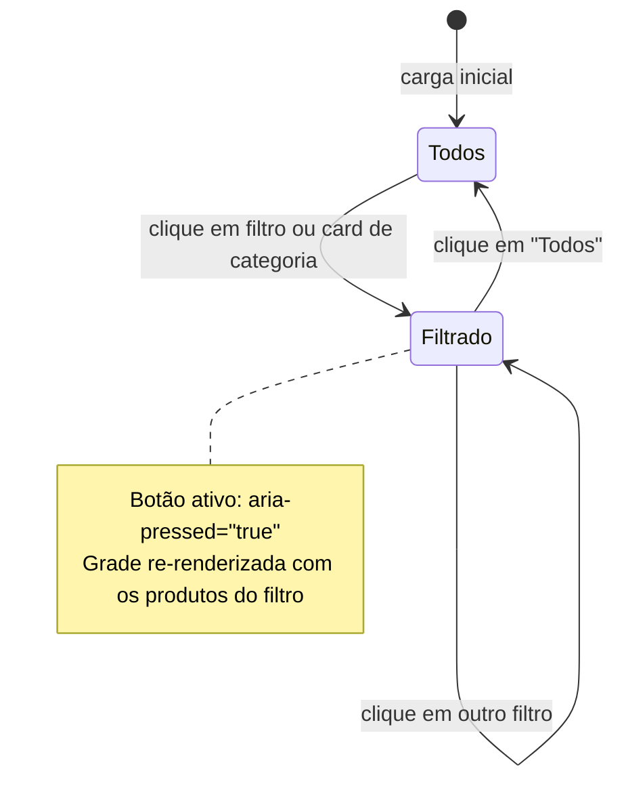
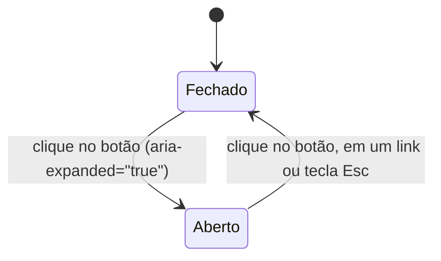

# Data Model: Landing Page Scorpion gytano

**Feature**: `001-scorpion-landing-page`
**Date**: 2026-10-08 (revisão: Lançamentos como indicador, mensagens por origem)
**Status**: Validated

Define as entidades de conteúdo da landing page. Os dados dinâmicos (configuração, categorias e produtos) ficam em `site/assets/js/config.js`, que é o único arquivo que a loja edita. Os conteúdos fixos (diferenciais, depoimentos e mosaico) ficam direto no `index.html`, o que favorece o SEO e dispensa JS.

| Entidade | Onde fica | Por quê |
|---|---|---|
| `StoreConfig` | `config.js` | Número e mensagens usados em vários pontos da página |
| `Category` | `config.js` | Alimenta os filtros e os cards de categoria |
| `Product` | `config.js` | Catálogo que muda com frequência |
| `BrandPillar` | `index.html` | 4 itens fixos |
| `Testimonial` | `index.html` | 3 a 4 itens fixos |
| `InstagramMedia` | `index.html` | 6 imagens fixas |

---

## 1. `StoreConfig`

| Campo | Tipo | Exemplo | Regra |
|---|---|---|---|
| `brandName` | `string` | `"Scorpion gytano"` | Obrigatório |
| `whatsappPhone` | `string` | `"5511999999999"` *(EXEMPLO)* | Apenas dígitos; DDI 55 + DDD + número (12 ou 13 dígitos) |
| `messages.header` | `string` | ver [contrato §7](contracts/ui-contracts.md) | Não vazio |
| `messages.floating` | `string` | ver contrato §7 | Não vazio |
| `messages.footer` | `string` | ver contrato §7 | Não vazio |
| `messages.product` | `(name: string) => string` | ver contrato §7 | O retorno contém `name` |
| `instagramHandle` | `string` | `"@scorpion.gytano"` | Começa com `@` |
| `instagramUrl` | `string` | `"https://www.instagram.com/scorpion.gytano/"` | URL https |
| `tiktokUrl` | `string` | `"https://www.tiktok.com/@scorpion.gytano"` *(EXEMPLO)* | URL https |
| `openingHours` | `string` | `"Seg a Sáb, 9h às 20h"` *(EXEMPLO)* | Exibido no rodapé |

---

## 2. `Category`

| Campo | Tipo | Exemplo | Regra |
|---|---|---|---|
| `id` | `"masculino" \| "feminino" \| "acessorios"` | `"masculino"` | Único |
| `label` | `string` | `"Masculino"` | Texto exibido no filtro e no card |
| `image` | `string` | `"assets/img/categorias/masculino.webp"` | WebP existente |

Filtros exibidos na vitrine (não são categorias): `todos` (padrão) e `lancamentos` (`isNew === true`).

---

## 3. `Product`

| Campo | Tipo | Obrigatório | Exemplo / Regra |
|---|---|---|---|
| `id` | `string` | Sim | kebab-case único, ex: `"jaqueta-couro-premium"` |
| `name` | `string` | Sim | 3 a 80 caracteres |
| `category` | `Category.id` | Sim | Um dos 3 ids válidos |
| `isNew` | `boolean` | Não (padrão `false`) | `true` → aparece no filtro "Lançamentos" |
| `material` | `string` | Sim | ex: `"Couro legítimo com forro térmico"` |
| `badge` | `"Mais Vendido" \| "Lançamento" \| "Edição Limitada"` | Não | Exatamente um dos 3 valores do FR-010 |
| `price` | `string` | Não | Texto livre formatado, ex: `"R$ 349,90"` |
| `image` | `string` | Sim | `assets/img/produtos/{id}.webp`, proporção 3:4, 600×800 |
| `alt` | `string` | Sim | Descrição da peça para acessibilidade |

A mensagem do WhatsApp **não** é um campo do produto: ela é gerada por `StoreConfig.messages.product(name)`, garantindo que sempre contenha o nome.

---

## 4. `BrandPillar` (HTML estático)

4 itens fixos, conforme o FR-013: ícone SVG, título e descrição curta.

## 5. `Testimonial` (HTML estático)

| Campo | Regra |
|---|---|
| Nome | Obrigatório |
| Localidade | Opcional |
| Nota | Inteiro de 1 a 5, exibido como estrelas, com o texto alternativo "Nota 5 de 5" |
| Relato | 80 a 280 caracteres |

## 6. `InstagramMedia` (HTML estático)

6 imagens quadradas `assets/img/insta/look-{1..6}.webp` (600×600), cada uma com `alt` e link para `StoreConfig.instagramUrl`.

---

## 7. Estados no Frontend

### Filtro da vitrine

### Menu mobile

