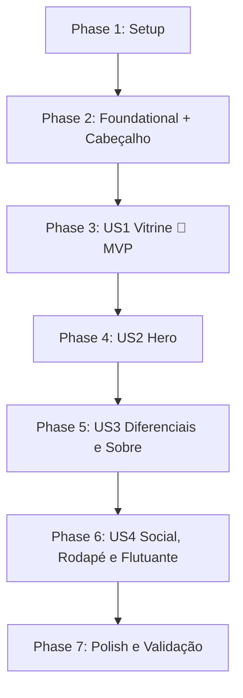

# Tasks: Landing Page Scorpion gytano

**Feature**: `001-scorpion-landing-page`
**Input**: Design documents from `/specs/001-scorpion-landing-page/` (revisão 2026-10-08: tema claro, referência visual do template)
**Prerequisites**: [plan.md](plan.md), [spec.md](spec.md), [research.md](research.md), [data-model.md](data-model.md), [contracts/ui-contracts.md](contracts/ui-contracts.md), [quickstart.md](quickstart.md)

**Tests**: A especificação não pede testes automatizados. A validação é o roteiro manual V1–V10 do `quickstart.md`.

**Regra de paralelismo**: `[P]` só aparece em tarefas que editam arquivos diferentes das demais tarefas pendentes da mesma fase. As tarefas que editam `site/index.html` ou `site/assets/js/main.js` são sempre sequenciais.

## Format: `[ID] [P?] [Story] Description`

- **[P]**: Pode rodar em paralelo (arquivos diferentes, sem dependência pendente)
- **[Story]**: História de usuário (US1–US4) à qual a tarefa pertence

---

## Phase 1: Setup (Shared Infrastructure)

**Purpose**: Estrutura de pastas, ferramentas de build, fonte e imagens de exemplo.

- [ ] T001 Criar as pastas `site/assets/css/`, `site/assets/js/`, `site/assets/fonts/`, `site/assets/img/hero/`, `site/assets/img/categorias/`, `site/assets/img/produtos/`, `site/assets/img/insta/`, `src/` e `src/img-originais/` na raiz do repositório
- [ ] T002 [P] Acrescentar `node_modules/` e `src/img-originais/` ao `.gitignore` existente na raiz, sem remover a linha `.claude/settings.local.json`
- [ ] T003 [P] Criar `package.json` na raiz com `"private": true`, devDependencies fixadas em versão exata (`npm install -D -E tailwindcss@3.4.17 sharp-cli @fontsource-variable/montserrat`) e os scripts `"dev": "tailwindcss -i src/input.css -o site/assets/css/styles.css --watch"` e `"build": "tailwindcss -i src/input.css -o site/assets/css/styles.css --minify"`
- [ ] T004 [P] Criar `tailwind.config.js` na raiz com: `content: ["./site/**/*.{html,js}"]`; `future: { hoverOnlyWhenSupported: true }`; `theme.extend.colors` com `ink: "#111111"`, `surface: "#F5F5F4"`, `line: "#E7E5E4"`, `muted: "#57534E"`, `brand: { DEFAULT: "#DC2626", dark: "#B91C1C", light: "#EF4444" }` e `whatsapp: "#25D366"`; `theme.extend.fontFamily.sans: ["Montserrat", "system-ui", "sans-serif"]`; e um plugin que registra a variante `pointer-fine` como `@media (hover: hover) and (pointer: fine)` (ver research.md §2–3 e contracts §6)
- [ ] T005 Copiar o arquivo `node_modules/@fontsource-variable/montserrat/files/montserrat-latin-wght-normal.woff2` para `site/assets/fonts/montserrat-latin-variable.woff2` (depende de T003)
- [ ] T006 Obter imagens de exemplo livres (Unsplash) de moda, com originais em `src/img-originais/`, e gerar em WebP com `npx sharp-cli`: `site/assets/img/hero/hero-768.webp`, `hero-1280.webp` e `hero-1920.webp` (16:9); `site/assets/img/sobre.webp` (1600px de largura); `site/assets/img/categorias/{masculino,feminino,acessorios}.webp` (600×800); 10 produtos em `site/assets/img/produtos/{id}.webp` (600×800, mesmos ids de T008); `site/assets/img/insta/look-{1..6}.webp` (600×600). Qualidade WebP entre 75 e 80. Criar também `site/assets/img/og-image.jpg` (1200×630), `site/assets/img/logo.svg` e `site/assets/img/logo-light.svg` provisórios (texto "SCORPION GYTANO" em `#111111` e em branco) e `site/assets/img/favicon.svg`, todos com o comentário `<!-- EXEMPLO: substituir -->` nos SVGs (depende de T001)

---

## Phase 2: Foundational (Blocking Prerequisites)

**Purpose**: CSS base, dados, utilitários de WhatsApp, esqueleto HTML com SEO, faixa superior e cabeçalho completo. Com isso, o MVP já tem navegação.

**⚠️ CRITICAL**: Nenhuma história de usuário começa antes desta fase terminar.

- [ ] T007 [P] Criar `src/input.css` com: `@tailwind base; @tailwind components; @tailwind utilities;`; `@font-face { font-family: "Montserrat"; src: url("../fonts/montserrat-latin-variable.woff2") format("woff2"); font-weight: 300 700; font-display: swap; }`; em `@layer base`, `html { scroll-behavior: smooth }` dentro de `@media (prefers-reduced-motion: no-preference)` e `body` com `bg-white text-ink font-sans antialiased`; em `@layer components`, as classes `.section-eyebrow` (`text-xs font-semibold uppercase tracking-[0.2em] text-brand-dark`), `.section-title` (`text-3xl md:text-4xl font-semibold text-ink mt-2`), `.btn-brand` (`inline-flex min-h-11 items-center justify-center gap-2 bg-brand px-8 py-3 text-sm font-semibold uppercase tracking-wider text-white transition-colors hover:bg-brand-dark`) e `.container-page` (`mx-auto max-w-[1200px] px-5`)
- [ ] T008 [P] Criar `site/assets/js/config.js` com `window.StoreConfig` e as listas `window.CATEGORIES` e `window.PRODUCTS`, conforme data-model.md: `whatsappPhone: "5511999999999"` com o comentário `// EXEMPLO: substituir` ("Apenas dígitos; DDI 55 + DDD + número (12 ou 13 dígitos)"); `messages.header`, `messages.footer` e `messages.floating` com os textos do contracts §7, e `messages.product(name)` cujo retorno contém `name`; `instagramHandle: "@scorpion.gytano"`, `instagramUrl`, `tiktokUrl` e `openingHours: "Seg a Sáb, 9h às 20h"` (estes dois com `// EXEMPLO`); as 3 categorias `masculino`, `feminino` e `acessorios` com `label` e `image`; e 10 produtos de exemplo distribuídos nas 3 categorias, pelo menos 3 com `isNew: true`, respeitando: `name` "entre 3 e 80 caracteres", `category` "um dos 3 ids válidos", `badge` "exatamente um dos 3 valores: Mais Vendido, Lançamento, Edição Limitada" (opcional), `image` "assets/img/produtos/{id}.webp" e `alt` obrigatório
- [ ] T009 [P] Criar `site/assets/js/main.js` (IIFE, `"use strict"`) com `buildWhatsAppLink(origin, productName)`, que retorna `https://wa.me/${StoreConfig.whatsappPhone}?text=${encodeURIComponent(msg)}` (sem barra antes do `?`), e `hydrateWhatsAppLinks(root)`, que define `href`, `target="_blank"` e `rel="noopener"` em todo `[data-whatsapp]` (lendo `data-product-name` quando `origin === "product"`), chamado em `DOMContentLoaded`
- [ ] T010 Criar `site/index.html` com `<html lang="pt-BR">` e `<head>` completo: `charset`, `viewport`, `<title>Scorpion gytano | Moda Urbana Premium com Atendimento no WhatsApp</title>`, `meta description` (150–160 caracteres), `link rel="canonical"` para `https://pedrooliv12.github.io/fashion-landing-page/`, Open Graph (`og:title`, `og:description`, `og:image` absoluto para `assets/img/og-image.jpg`, `og:url`, `og:type=website`, `og:locale=pt_BR`), `twitter:card=summary_large_image`, `theme-color #111111`, favicon SVG, `preload` da fonte (`as="font" type="font/woff2" crossorigin`), `preload` da imagem da Hero (`as="image" imagesrcset="assets/img/hero/hero-768.webp 768w, assets/img/hero/hero-1280.webp 1280w, assets/img/hero/hero-1920.webp 1920w" imagesizes="100vw"`), `assets/css/styles.css` e os scripts `config.js` e `main.js` com `defer`, nessa ordem; JSON-LD `ClothingStore` (nome, url, logo, sameAs com o Instagram). No `<body>`, criar os marcadores vazios na ordem do FR-019: `#top-bar`, `<header id="site-header">`, `<main>` contendo `<section>` com ids `inicio`, `diferenciais`, `categorias`, `colecoes`, `sobre` e `depoimentos`, todas com a classe `scroll-mt-24`, e `<footer id="rodape">`
- [ ] T011 Implementar em `site/index.html` a faixa `#top-bar` (`bg-ink text-white text-xs text-center py-2`, texto "Atendimento VIP pelo WhatsApp · Pix e Cartão de Crédito") e o `<header id="site-header">` conforme contracts §2: `sticky top-0 z-40 bg-white border-b border-line`, altura de 64 a 72px; `#brand-logo` com `logo.svg` e `width`/`height`; `nav[aria-label="Principal"]` (`hidden md:flex`) com links `[data-nav-link]` em caixa alta para `#inicio` (Início), `#diferenciais` (Diferenciais), `#colecoes` (Coleções), `#sobre` (Sobre a Marca) e `#depoimentos` (Depoimentos); botão `a[data-whatsapp="header"]` em `bg-whatsapp text-ink font-semibold` com o SVG do WhatsApp (Simple Icons) e o texto "Atendimento no WhatsApp" visível a partir de `sm` (no mobile, só o ícone, com `aria-label`), mínimo 44×44px; botão `#menu-toggle` (`md:hidden`, 44×44px, `aria-controls="mobile-menu"`, `aria-expanded="false"`, `aria-label="Abrir menu"`, ícone SVG Lucide `menu`); e `#mobile-menu` (`hidden md:hidden`) com os mesmos links, cada um com `min-h-11` (depende de T010)
- [ ] T012 Implementar em `site/assets/js/main.js` o menu mobile: o clique em `#menu-toggle` alterna `hidden` em `#mobile-menu`, `aria-expanded` e `aria-label` ("Abrir menu" / "Fechar menu") e troca o ícone; o menu fecha ao clicar em qualquer `#mobile-menu [data-nav-link]` e com a tecla `Escape`, devolvendo o foco ao botão (depende de T009)
- [ ] T013 Rodar `npm install` e `npm run build`, servir com `npx serve site -p 3000` e conferir em 375px e 1440px: fonte Montserrat carregada de `assets/fonts/`, faixa superior, cabeçalho fixo, menu mobile abrindo e fechando, e o botão verde abrindo `wa.me` com a mensagem `header` (gera `site/assets/css/styles.css`)

**Checkpoint**: Base pronta, com cabeçalho e navegação funcionando. As histórias de usuário podem começar.

---

## Phase 3: User Story 1 - Vitrine de Produtos e Compra via WhatsApp (Priority: P1) 🎯 MVP

**Goal**: O visitante filtra a vitrine, usa os cards de categoria como atalho e inicia a compra no WhatsApp com a peça já identificada.

**Independent Test**: quickstart V3. Filtrar por cada categoria e por Lançamentos; clicar no card "Feminino" de Categorias; testar o hover no desktop, o `Tab` no card e o toque no mobile; o botão "Garantir no WhatsApp" abre `wa.me` com o nome exato da peça.

- [ ] T014 [US1] Implementar em `site/index.html` a seção `#categorias` (contracts §5): título no padrão `.section-eyebrow`/`.section-title` ("Explore por" / "Categorias em Destaque") e grade `grid-cols-1 md:grid-cols-3 gap-6` com 3 `a.category-card.group[href="#colecoes"][data-filter-target]` para `masculino`, `feminino` e `acessorios`, cada um com `h-96 relative overflow-hidden`, `` com `object-cover motion-safe:transition-transform motion-safe:duration-500 group-hover:scale-105`, degradê `bg-gradient-to-t from-ink/60 to-transparent`, `<h3>` branco e o texto "Ver peças" com `border-b-2 border-brand`
- [ ] T015 [US1] Implementar em `site/index.html` a seção `#colecoes` (`bg-surface py-20`, contracts §6): título ("Os mais desejados" / "Coleções"); `#product-filters` com `role="group" aria-label="Filtrar produtos"`, contêiner `flex gap-2 overflow-x-auto` (só o grupo rola) e 5 `<button data-filter>` para `todos` (`aria-pressed="true"`), `masculino`, `feminino`, `acessorios` e `lancamentos`, cada um com `min-h-11 px-5 uppercase text-xs tracking-wider shrink-0`; `#products-grid` com `grid grid-cols-1 min-[400px]:grid-cols-2 lg:grid-cols-3 xl:grid-cols-4 gap-6` e `aria-live="polite"`; e `#products-empty` (`hidden`) com o texto "Nenhuma peça nesta categoria no momento."
- [ ] T016 [US1] Implementar em `site/assets/js/main.js` a função `renderProducts(filter)`, que gera os `article.product-card` exatamente na estrutura do contracts §6: badge opcional `bg-brand`; `` com `loading="lazy" width="600" height="800"`, `alt` do produto e `motion-safe:group-hover:scale-105`; o botão desktop `a[data-whatsapp="product"][data-product-name]` com `hidden pointer-fine:flex absolute inset-x-0 bottom-0 translate-y-full group-hover:translate-y-0 group-focus-within:translate-y-0 motion-safe:transition-transform`; e o botão de toque `pointer-fine:hidden`, largura total e `min-h-11`. Ambos com `bg-brand hover:bg-brand-dark text-white uppercase`, texto "Garantir no WhatsApp" e ícone, e com `href` gerado na renderização via `buildWhatsAppLink("product", name)`. Usar `textContent` ou escape para os dados do produto (sem `innerHTML` com dados crus) e mostrar `#products-empty` quando a lista estiver vazia
- [ ] T017 [US1] Implementar em `site/assets/js/main.js` os filtros: o clique em `[data-filter]` chama `renderProducts` (`todos` mostra todos; `masculino`/`feminino`/`acessorios` filtram por `product.category`; `lancamentos` filtra por `product.isNew === true`) e atualiza `aria-pressed` e o estilo ativo (`bg-ink text-white` contra `border border-line bg-white text-ink`); o clique em `[data-filter-target]` aplica o filtro correspondente, mantendo a rolagem nativa da âncora; renderizar `todos` no `DOMContentLoaded`
- [ ] T018 [US1] Rodar `npm run build` e executar o quickstart V3 em 375px (modo toque) e 1440px (mouse), corrigindo o que falhar em `site/index.html` ou `site/assets/js/main.js`

**Checkpoint**: MVP de vendas funcional: navegação, vitrine com filtros e compra via WhatsApp.

---

## Phase 4: User Story 2 - Hero Section e Atendimento Rápido (Priority: P1)

**Goal**: Primeira dobra de impacto no estilo do template, com o CTA vermelho levando à vitrine.

**Independent Test**: quickstart V2. Em 375px: logo do cabeçalho → headline → texto → botão vermelho visível sem rolar; o botão rola até `#colecoes`.

- [ ] T019 [US2] Implementar em `site/index.html` a seção `#inicio` (contracts §3): contêiner `relative flex h-[85vh] min-h-[520px] items-center justify-center overflow-hidden text-center text-white`; `` com `src="assets/img/hero/hero-1280.webp"`, o mesmo `srcset` do preload de T010, `sizes="100vw"`, `fetchpriority="high"`, `width="1920" height="1080"`, `alt` descritivo, `absolute inset-0 h-full w-full object-cover` e **sem** `loading="lazy"`; sobreposição `absolute inset-0 bg-ink/45`; conteúdo `relative z-10 max-w-2xl px-5 flex flex-col items-center gap-5`, com `#hero-badge` ("Nova Coleção", `bg-white/20 backdrop-blur px-4 py-1.5 text-xs uppercase tracking-widest`), `<h1 id="hero-headline">` "Estilo, Atitude e Exclusividade em Cada Peça" (`text-4xl md:text-6xl font-semibold leading-tight`), `#hero-description` com o texto exato do FR-006 (`text-base md:text-lg font-light`) e `a#hero-cta.btn-brand[href="#colecoes"]` "Ver Coleção & Falar com Vendedor"
- [ ] T020 [US2] Rodar `npm run build` e executar o quickstart V2 em 320px, 375px e 1440px, confirmando o botão visível sem rolagem em 375×667 e, no painel Performance, que o elemento LCP é `#hero-image`

**Checkpoint**: As histórias 1 e 2 cobrem o primeiro impacto e a vitrine.

---

## Phase 5: User Story 3 - Marca e Confiança (Priority: P2)

**Goal**: Diferenciais logo após a Hero e banner institucional "Sobre a Marca".

**Independent Test**: Os 4 diferenciais aparecem com o texto exato do FR-013, logo abaixo da Hero; a seção `#sobre` é legível sobre a foto.

- [ ] T021 [US3] Implementar em `site/index.html` a seção `#diferenciais` (contracts §4): `py-12 border-b border-line`; grade `grid-cols-1 sm:grid-cols-2 lg:grid-cols-4 gap-8`; 4 `<article class="flex items-center gap-4">` com ícone SVG Lucide inline `w-8 h-8 text-brand` (`aria-hidden="true"`: `truck`, `message-circle`, `credit-card` e `gem`), `<h3 class="text-sm font-semibold">` e `<p class="text-xs text-muted">`, com os títulos e as descrições exatamente como no FR-013
- [ ] T022 [US3] Implementar em `site/index.html` a seção `#sobre` (contracts §8): `relative py-24 text-center text-white overflow-hidden`; `` em `absolute inset-0 object-cover`; sobreposição `bg-ink/55`; conteúdo `relative z-10 max-w-2xl mx-auto px-5` com rótulo `text-brand-light` ("Nossa essência"), `<h2>` ("Sobre a Scorpion gytano") e 2 parágrafos corridos cobrindo o conceito da marca, a curadoria de tecidos, a costura e o acabamento, e a consultoria de tamanhos e medidas com atendente humano (FR-012)

**Checkpoint**: A página comunica valor e confiança.

---

## Phase 6: User Story 4 - Prova Social, Comunidade, Rodapé e Botão Flutuante (Priority: P2)

**Goal**: Depoimentos, mosaico do Instagram, rodapé completo e acesso permanente ao WhatsApp.

**Independent Test**: quickstart V5. Depoimentos e mosaico visíveis; o botão flutuante fica fixo em qualquer rolagem e não cobre o rodapé; os botões do rodapé e o flutuante abrem `wa.me` com as mensagens `footer` e `floating`.

- [ ] T023 [US4] Implementar em `site/index.html` a seção `#depoimentos` (contracts §9): título ("Quem compra, recomenda" / "Depoimentos"); grade `md:grid-cols-3 gap-6` com 3 `<figure class="border border-line p-6">`, cada um com 5 estrelas SVG `text-brand` dentro de um contêiner `role="img" aria-label="Nota 5 de 5"`, `<blockquote>` (relato de "80 a 280 caracteres" sobre qualidade, entrega ou atendimento) e `<figcaption>` (nome + cidade em `text-muted`), todos marcados `<!-- EXEMPLO: substituir -->`; em seguida, o bloco Instagram com o título "Siga @scorpion.gytano", mosaico `grid grid-cols-3 md:grid-cols-6 gap-1` de 6 links `a[data-social="instagram"]` com `` e `aria-label`, e o botão "Seguir no Instagram" (`border border-ink min-h-11 uppercase`)
- [ ] T024 [US4] Implementar em `site/index.html` o `<footer id="rodape">` (contracts §10): `bg-ink text-line pt-16 pb-24 md:pb-8`; grade `sm:grid-cols-2 lg:grid-cols-4 gap-10`; coluna 1 com `logo-light.svg`, uma frase da marca e os ícones Instagram e TikTok (`a[data-social]` 44×44px com `aria-label`); coluna 2, "Navegação", com links para as 6 seções; coluna 3, "Atendimento", com o horário (`data-store="openingHours"`) e `a[data-whatsapp="footer"]` com `.btn-brand` "Falar no WhatsApp"; coluna 4, "Pagamento", com "Pix e Cartão de Crédito"; linha `border-t border-white/10` com "© 2026 Scorpion gytano. Todos os direitos reservados."
- [ ] T025 [US4] Implementar em `site/index.html`, antes de `</body>`, o `a#floating-whatsapp[data-whatsapp="floating"]` (contracts §11): `fixed bottom-5 right-5 z-50 flex h-14 w-14 items-center justify-center rounded-full bg-whatsapp shadow-lg`, `aria-label="Falar com a Scorpion gytano no WhatsApp"`, com `<span aria-hidden="true" class="absolute inset-0 rounded-full bg-whatsapp opacity-40 motion-safe:animate-ping">` e o SVG branco do WhatsApp `relative h-7 w-7`
- [ ] T026 [US4] Implementar em `site/assets/js/main.js` o preenchimento a partir de `StoreConfig`: `href` de `[data-social="instagram"]` e `[data-social="tiktok"]` (com `target="_blank" rel="noopener"`) e `textContent` de `[data-store="openingHours"]`, chamado em `DOMContentLoaded` junto com `hydrateWhatsAppLinks`
- [ ] T027 [US4] Rodar `npm run build` e executar o quickstart V5 (inclusive com `prefers-reduced-motion: reduce`), conferindo em 375px que o botão flutuante não cobre nenhum link do rodapé no fim da página

**Checkpoint**: Todas as seções do FR-019 estão implementadas.

---

## Phase 7: Polish & Cross-Cutting Concerns

**Purpose**: Movimento, paleta, performance, documentação e validação final.

- [ ] T028 Revisar `site/index.html` e `site/assets/js/main.js` para garantir: toda animação ou transição de movimento (`animate-ping`, `scale`, `translate`) com prefixo `motion-safe:`; toda `<section>` com `scroll-mt-24`; toda `` com `alt`, `width` e `height`; e `loading="lazy"` em todas as imagens, exceto `#hero-image` e o logo
- [ ] T029 [P] Auditar a paleta em `site/index.html` e `site/assets/js/main.js` com `git grep -nE "(bg|text|border|from|to)-(black|red|green|gray|neutral|zinc|slate|stone)" site/`: nenhum resultado é aceitável (usar só os tokens `ink`, `surface`, `line`, `muted`, `brand*`, `whatsapp` e `white`); `bg-whatsapp` só pode aparecer em `data-whatsapp="header"` e `#floating-whatsapp` (Constituição v1.1.0, Princípio II)
- [ ] T030 [P] Criar `README.md` na raiz com: como instalar e compilar (`npm install`, `npm run dev`, `npm run build`), como servir (`npx serve site`), como a loja edita produtos e número em `site/assets/js/config.js`, como adicionar uma imagem de produto em WebP 600×800 e a lista de itens `EXEMPLO` a substituir antes de publicar
- [ ] T031 Rodar `npm run build` (CSS minificado em `site/assets/css/styles.css`) e executar o roteiro completo V1–V10 do `specs/001-scorpion-landing-page/quickstart.md`, registrando no fim do `quickstart.md` uma tabela "Resultado da validação (data)" com o status de cada item e a nota do Lighthouse. V10 deve falhar enquanto houver conteúdo `EXEMPLO`; isso é esperado e fica registrado como pendência da loja

---

## Dependencies & Execution Order

### Phase Dependencies

- **Setup (Phase 1)**: sem dependências. T005 depende de T003 (pacote da fonte); T006 depende de T001.
- **Foundational (Phase 2)**: depende da Phase 1 e **bloqueia** todas as histórias. Ordem interna: T007/T008/T009 em paralelo → T010 → T011 → T012 → T013.
- **US1 (Phase 3)** e **US2 (Phase 4)**: dependem só da Phase 2. As duas editam `site/index.html`, então rodam em sequência (US1 primeiro, porque é o MVP).
- **US3 (Phase 5)** e **US4 (Phase 6)**: dependem só da Phase 2; também em sequência, pelo mesmo arquivo.
- **Polish (Phase 7)**: depende das histórias desejadas.

### User Story Dependencies

- **US1**: independente (usa `config.js`, `main.js` e as seções `#categorias`/`#colecoes`).
- **US2**: independente; o CTA aponta para `#colecoes`, que já existe como marcador desde T010.
- **US3**: independente.
- **US4**: independente; T026 depende de T024 e T023 para os seletores `data-social` e `data-store`.



As setas entre as histórias indicam só a ordem sugerida, por causa do arquivo compartilhado `index.html`, não uma dependência funcional.

---

## Parallel Example: Phase 1

```text
Depois de T001:
  T002 .gitignore
  T003 package.json
  T004 tailwind.config.js
```

## Parallel Example: Phase 2

```text
Em paralelo:
  T007 src/input.css
  T008 site/assets/js/config.js
  T009 site/assets/js/main.js
Depois, em sequência: T010 → T011 → T012 → T013
```

## Parallel Example: Phase 7

```text
Em paralelo, depois de T028:
  T029 auditoria da paleta (somente leitura + correções pontuais)
  T030 README.md
```

---

## Implementation Strategy

### MVP First (Setup + Foundational + US1)

1. Phase 1 e Phase 2: build, dados, cabeçalho e navegação.
2. Phase 3 (US1): categorias, vitrine, filtros e compra via WhatsApp.
3. **Validar o MVP** com o quickstart V3 e V4. Neste ponto a loja já consegue vender pela página.

### Incremental Delivery

1. + US2 (Hero) → validar V2 e o LCP.
2. + US3 (Diferenciais e Sobre) → validar o texto do FR-013.
3. + US4 (Depoimentos, Instagram, Rodapé, Flutuante) → validar V5.
4. Polish → V1–V10 e Lighthouse ≥ 90.
5. Substituir todo o conteúdo `EXEMPLO` pelo material da loja e repetir V9–V10 antes de publicar.
