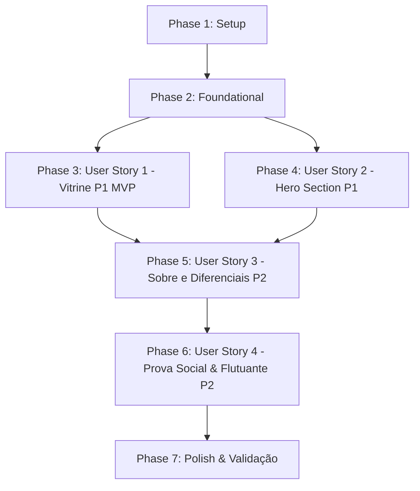

# Tasks: Landing Page Scorpion gytano

**Feature**: `001-scorpion-landing-page`  
**Plan**: [plan.md](plan.md) | **Spec**: [spec.md](spec.md)  
**Status**: Ready for Implementation

Este documento lista todas as tarefas atômicas e ordenadas por dependência para a implementação da landing page da **Scorpion gytano**, estruturadas por histórias de usuário para permitir entrega contínua e MVP independente.

---

## Phase 1: Setup (Shared Infrastructure)

**Purpose**: Inicialização da estrutura física de diretórios e ativos compartilhados.

- [ ] T001 Criar estrutura de diretórios do projeto estático em `site/` (`site/assets/css/`, `site/assets/js/`, `site/assets/fonts/`, `site/assets/img/produtos/`, `site/assets/img/insta/`)
- [ ] T002 [P] Baixar e configurar arquivos de fontes locais Outfit e Montserrat no formato `.woff2` em `site/assets/fonts/`
- [ ] T003 [P] Organizar arquivos de mídia inicial da marca (logotipo com fundo transparente e imagem de capa da Hero) em `site/assets/img/logo.png` e `site/assets/img/capa.jpg`

---

## Phase 2: Foundational (Blocking Prerequisites)

**Purpose**: Infraestrutura de estilos base, dados e scripts que bloqueia o desenvolvimento das histórias de usuário.

> **CRÍTICO**: Nenhuma história de usuário deve ser iniciada antes da conclusão desta fase foundational.

- [ ] T004 Criar arquivo base de estilos e design tokens com declarações `@font-face` (Outfit e Montserrat) e utilitários Tailwind compilados em `site/assets/css/styles.css`
- [ ] T005 [P] Criar arquivo modular de catálogo e configurações (`StoreConfig`, categorias, produtos com tags e diferenciais) em `site/assets/js/catalog.js`
- [ ] T006 [P] Criar biblioteca de utilitários JavaScript (`main.js`) com codificação universal de URLs do WhatsApp (`buildWhatsAppLink`) e navegação suave em `site/assets/js/main.js`
- [ ] T007 Criar esqueleto semântico HTML5 com metatags de SEO em pt-BR, metatags de Open Graph para WhatsApp e viewport responsivo em `site/index.html`

**Checkpoint**: Base foundational pronta — implementação das histórias de usuário pode começar.

---

## Phase 3: User Story 1 - Exploração da Vitrine de Produtos e Compra via WhatsApp (Priority: P1) 🎯 MVP

**Goal**: Permitir que o visitante explore a vitrine de roupas e acessórios dividida por categorias, interaja com efeito hover e inicie a compra no WhatsApp com a peça já selecionada.

**Independent Test**: Navegar até a vitrine, alternar entre as categorias (Masculino, Feminino, Acessórios, Lançamentos), passar o mouse no card para verificar o zoom e clicar em "Garantir no WhatsApp", validando a abertura do link `wa.me` com o nome do produto codificado.

### Implementation for User Story 1

- [ ] T008 [P] [US1] Implementar estilos do grid responsivo de produtos (`grid-cols-1 sm:grid-cols-2 lg:grid-cols-3 xl:grid-cols-4`), badges e efeito de zoom no hover em `site/assets/css/styles.css`
- [ ] T009 [P] [US1] Implementar lógica de renderização dinâmica dos cards de produto e filtro por categorias ("todos", "masculino", "feminino", "acessorios", "lancamentos") em `site/assets/js/catalog.js`
- [ ] T010 [US1] Implementar seção HTML de Coleções (`<section id="colecoes">`) com abas de categoria acessíveis e contêiner da vitrine em `site/index.html`
- [ ] T011 [US1] Vincular eventos de clique nos botões "Garantir no WhatsApp" de cada card para gerar a mensagem com o nome da peça em `site/assets/js/catalog.js`

**Checkpoint**: Neste ponto, a User Story 1 está completa e testável como MVP de vendas.

---

## Phase 4: User Story 2 - Primeiro Impacto na Hero Section e Atendimento Rápido (Priority: P1)

**Goal**: Apresentar ao visitante recém-chegado uma Hero Section imponente de alta conversão, com visual escuro (`#0A0A0A`), gradientes de transição para ultra-wide, tipografia marcante, reordenação estrita no mobile e CTA em vermelho marcante.

**Independent Test**: Carregar a página em resolução desktop e mobile (< 768px), certificando-se de que no mobile a ordem exibida é: 1. Logo, 2. Headline, 3. Descrição, 4. Botão CTA Vermelho, e que o botão conduz à vitrine e ao atendimento.

### Implementation for User Story 2

- [ ] T012 [P] [US2] Implementar estilos da Hero Section com sobreposição de gradientes escuros (`#0A0A0A`), degradês de borda para telas ultra-wide e filtro de contraste da logo em `site/assets/css/styles.css`
- [ ] T013 [US2] Implementar estrutura semântica da Hero Section (`<section id="hero">`) em `site/index.html` respeitando a ordem obrigatória mobile-first (Logo -> Headline -> Texto corrido -> Botão CTA)
- [ ] T014 [US2] Vincular ação de clique do botão principal "Ver Coleção & Falar com Vendedor" para rolagem suave até `#colecoes` ou abertura do WhatsApp em `site/assets/js/main.js`

**Checkpoint**: User Stories 1 e 2 funcionam integradas, cobrindo o primeiro impacto e a vitrine de produtos.

---

## Phase 5: User Story 3 - Conhecimento da Marca e Percepção de Confiança (Priority: P2)

**Goal**: Expor a essência da marca Scorpion gytano (curadoria de tecidos, costura premium e consultoria de medidas) e os 4 diferenciais de serviço (envio, atendimento VIP, pagamento facilitado e peças exclusivas) para mitigar objeções de compra.

**Independent Test**: Rolar até as seções "Sobre a Marca" e "Diferenciais", verificando a legibilidade do texto corrido institucional e a distribuição responsiva dos 4 cards de benefícios.

### Implementation for User Story 3

- [ ] T015 [P] [US3] Implementar estilos e tipografia para a seção institucional e layout em grade para os 4 cards de diferenciais em `site/assets/css/styles.css`
- [ ] T016 [US3] Implementar seção "Sobre a Marca" (`<section id="sobre">`) com texto corrido contínuo sobre o conceito da marca, curadoria de tecidos e atendimento com atendente real em `site/index.html`
- [ ] T017 [US3] Implementar seção de Diferenciais e Garantias (`<section id="diferenciais">`) com os 4 cards (🚀 Envio Rápido, 💬 Atendimento VIP, 💳 Pagamento Facilitado, 🔥 Peças Exclusivas) em `site/index.html`

**Checkpoint**: A página comunica valor, exclusividade e segurança antes da tomada de decisão do cliente.

---

## Phase 6: User Story 4 - Prova Social, Conexão com Comunidade e Acesso Flutuante Contínuo (Priority: P2)

**Goal**: Fornecer prova social através de depoimentos de clientes reais, mosaico fotográfico do Instagram, navegação fixa completa no cabeçalho, botão flutuante pulsante de WhatsApp e rodapé informativo.

**Independent Test**: Verificar o carrossel/grid de depoimentos, a chamada para `@scorpion.gytano`, o funcionamento do menu hamburger mobile e a presença contínua do botão flutuante do WhatsApp em qualquer posição de rolagem da tela.

### Implementation for User Story 4

- [ ] T018 [P] [US4] Implementar seção de Prova Social (`<section id="depoimentos">`) com depoimentos avaliativos de clientes reais em `site/index.html`
- [ ] T019 [P] [US4] Implementar seção de Comunidade com mosaico de fotos do Instagram e convite para marcar `@scorpion.gytano` em `site/index.html`
- [ ] T020 [US4] Implementar cabeçalho fixo (`#navbar`) com logotipo, links de rolagem suave para as 5 seções, botão "Atendimento no WhatsApp" e botão de menu mobile em `site/index.html`
- [ ] T021 [P] [US4] Implementar interatividade do menu mobile (abrir/fechar/backdrop e fechamento automático ao clicar em link) em `site/assets/js/main.js`
- [ ] T022 [US4] Implementar botão flutuante do WhatsApp (`#floating-whatsapp`) fixado no canto inferior direito com animação de pulso contínuo em `site/index.html` e `site/assets/css/styles.css`
- [ ] T023 [P] [US4] Implementar rodapé completo (`<footer id="footer">`) com atalhos de navegação, redes sociais, horário de atendimento e copyright em `site/index.html`

**Checkpoint**: Todas as 7 seções e utilitários da landing page estão totalmente implementados e funcionais.

---

## Phase 7: Polish & Cross-Cutting Concerns

**Purpose**: Otimizações globais de performance, conformidade mobile rigorosa e validação ponta a ponta.

- [ ] T024 [P] Otimizar imagens de produtos e lookbook para formato moderno WebP com carregamento preguiçoso (`loading="lazy"`) em `site/assets/img/`
- [ ] T025 Validar conformidade de responsividade mobile (320px sem overflow-x) e áreas mínimas de toque de 44x44px em `site/assets/css/styles.css`
- [ ] T026 Executar roteiro completo de validação ponta a ponta conforme especificado em `specs/001-scorpion-landing-page/quickstart.md`

---

## Dependencies & Execution Order

### Phase Dependencies

- **Setup (Phase 1)**: Sem dependências — pode ser executada imediatamente.
- **Foundational (Phase 2)**: Depende da conclusão da Phase 1 — **BLOQUEIA** todas as histórias de usuário.
- **User Stories (Phases 3-6)**: Todas dependem da Phase 2 (Foundational):
  - **User Story 1 (P1)**: Pode ser executada imediatamente após a Phase 2 (Caminho crítico do MVP).
  - **User Story 2 (P1)**: Pode ser executada em paralelo com US1 ou imediatamente após.
  - **User Story 3 (P2)**: Depende da estrutura base de index.html e styles.css.
  - **User Story 4 (P2)**: Conclui a experiência com prova social, navbar completa e botão flutuante.
- **Polish (Phase 7)**: Depende da implementação de todas as histórias de usuário desejadas.



---

## Parallel Execution Examples

### Execução Paralela da Fase 1 (Setup)
```bash
# Executar simultaneamente em arquivos distintos:
Task T002: "Baixar e configurar fontes locais Outfit e Montserrat em site/assets/fonts/"
Task T003: "Organizar arquivos de mídia inicial em site/assets/img/logo.png e site/assets/img/capa.jpg"
```

### Execução Paralela da Fase 2 (Foundational)
```bash
# Executar simultaneamente após T004:
Task T005: "Criar arquivo modular de catálogo em site/assets/js/catalog.js"
Task T006: "Criar utilitários JavaScript em site/assets/js/main.js"
```

### Execução Paralela na User Story 1 (MVP)
```bash
Task T008: "Implementar estilos do grid responsivo em site/assets/css/styles.css"
Task T009: "Implementar lógica de renderização dos cards em site/assets/js/catalog.js"
```

---

## Implementation Strategy

### MVP First (User Story 1 & Hero Base)
1. Concluir **Phase 1: Setup** e **Phase 2: Foundational** (Criação de `styles.css`, `catalog.js`, `main.js`, `index.html`).
2. Concluir **Phase 3: User Story 1** (Vitrine de produtos com filtros e botão WhatsApp).
3. Concluir **Phase 4: User Story 2** (Hero Section de impacto com reordenação mobile-first).
4. **Validar MVP**: Testar abertura da página, visualização dos produtos e envio de mensagem de teste para o WhatsApp.

### Entrega Incremental Completa
1. Adicionar **Phase 5: User Story 3** (Seções Sobre a Marca e Diferenciais de Confiança).
2. Adicionar **Phase 6: User Story 4** (Depoimentos, Mosaico Instagram, Navbar com Smooth Scroll e Botão Flutuante Pulsante).
3. Executar **Phase 7: Polish** para garantir carregamento instantâneo, notas máximas de SEO/Lighthouse e validação no `quickstart.md`.
